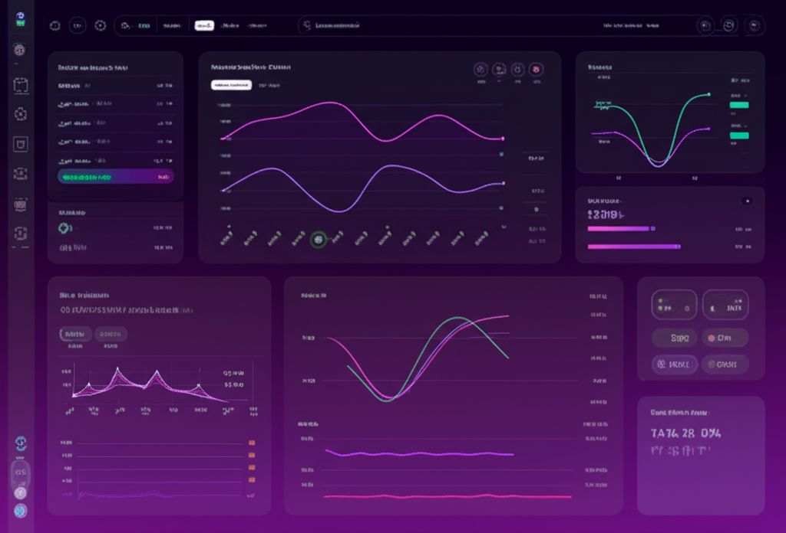

# Horizon - Modern Landing Page

## 🚀 [Live Demo](https://modern-landingpagednzdev.netlify.app/)

A modern, responsive landing page with smooth animations and scroll effects. This demo showcases best practices for creating engaging web experiences with Next.js and Framer Motion.

## ✨ Features

- **Fully Responsive Design** - Looks great on all devices from mobile to desktop
- **Modern UI Components** - Clean, professional design with attention to detail
- **Smooth Animations** - Subtle animations enhance the user experience
- **Scroll Effects** - Engaging scroll-triggered animations and parallax effects
- **Performance Optimized** - Fast loading times and smooth interactions
- **SEO Friendly** - Built with best practices for search engine optimization
- **Accessibility Focused** - Follows WCAG guidelines for maximum inclusivity

## 🛠️ Technologies Used

- [Next.js](https://nextjs.org/) - React framework for production
- [React](https://reactjs.org/) - JavaScript library for building user interfaces
- [TypeScript](https://www.typescriptlang.org/) - Typed JavaScript
- [Tailwind CSS](https://tailwindcss.com/) - Utility-first CSS framework
- [Framer Motion](https://www.framer.com/motion/) - Animation library for React
- [Lucide Icons](https://lucide.dev/) - Beautiful open-source icons
- [shadcn/ui](https://ui.shadcn.com/) - Re-usable UI components

## 📋 Sections

- Hero section with animated elements
- Features showcase with icons and descriptions
- Testimonials from satisfied customers
- Pricing plans with highlighted options
- Call-to-action section with email signup
- Comprehensive footer with navigation links

## 🚀 Getting Started

### Prerequisites

- Node.js 18.0.0 or later
- npm or yarn

### Installation

1. Clone the repository:
   \`\`\`bash
   git [clone https://github.com/yourusername/horizon-landing.git](https://github.com/dnx01/Modern-LandingPage)
   \`\`\`

2. Install dependencies:
   \`\`\`bash
   npm install
   # or
   yarn install
   \`\`\`

3. Run the development server:
   \`\`\`bash
   npm run dev
   # or
   yarn dev
   \`\`\`

4. Open [http://localhost:3000](http://localhost:3000) in your browser to see the result.

## 🔧 Customization

### Changing Colors

The main color scheme uses purple and pink gradients. You can modify the colors in the `tailwind.config.ts` file.

### Adding Content

- Update the content in `app/page.tsx` to change text, images, and sections
- Add new components in the `components` directory
- Modify animations by adjusting the Framer Motion parameters

### Images

Replace the placeholder images in the `public` directory with your own images.

## 📱 Responsive Design

The landing page is fully responsive and optimized for:
- Mobile devices (320px and up)
- Tablets (768px and up)
- Desktops (1024px and up)
- Large screens (1280px and up)

## 🌐 Deployment

This project can be easily deployed to Vercel:

## 📄 License

This project is licensed under the MIT License - see the LICENSE file for details.

## 🙏 Acknowledgements

- Design inspiration from modern SaaS websites
- Icons from [Lucide](https://lucide.dev/)
- UI components from [shadcn/ui](https://ui.shadcn.com/)

---

## 📬 Contact

For any questions or feedback, please reach out to:
- Email: dnz@myself.com
- Twitter: [@dnzcode](https://x.com/dnzcode)

---

**Note:** This is a demo project created for educational purposes. Feel free to use it as a template for your own landing pages.
